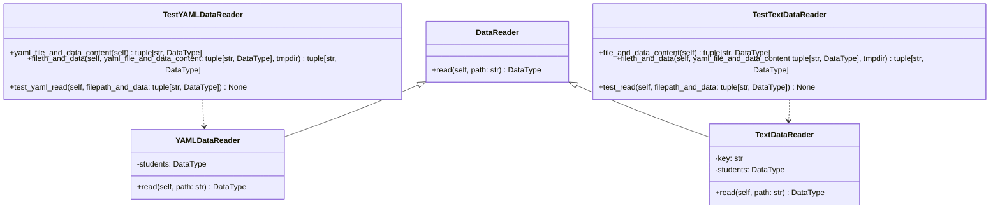
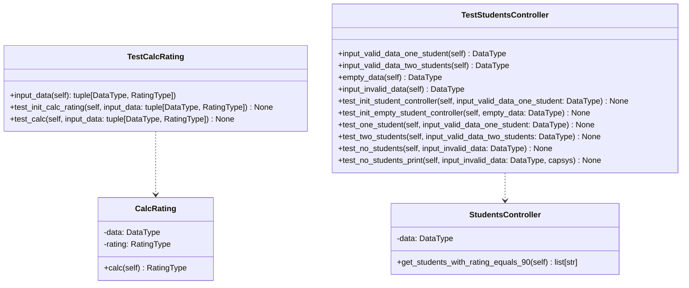

# Лабораторная работа №1 по дисциплине "Технологии программирования"

## Знакомство с системой контроля версий Git и инструментом CI/CD GitHub Actions

### Цели работы:

1. Познакомиться c распределенной системой контроля версий кода Git и ее функциями;
2. Познакомиться с понятиями «непрерывная интеграция» (CI) и «непрерывное развертывание»
   (CD), определить их место в современной разработке программного обеспечения;
3. Получить навыки разработки ООП-программ и написания модульных тестов к ним на
   современных языках программирования;
4. Получить навыки работы с системой Git для хранения и управления версиями ПО;
5. Получить навыки управления автоматизированным тестированием программного обеспечения, расположенного в системе Git, с
   помощью инструмента GitHub Actions.

### 9 вариант
Формат входного файла - YAML.

Необходимо определить и вывести на экран студента, имеющего 90 баллов по всем дисциплинам. Если таких студентов несколько, нужно
вывести любого из них. Если таких студентов нет, необходимо вывести сообщение об их
отсутствии.

### UML-диаграмма

